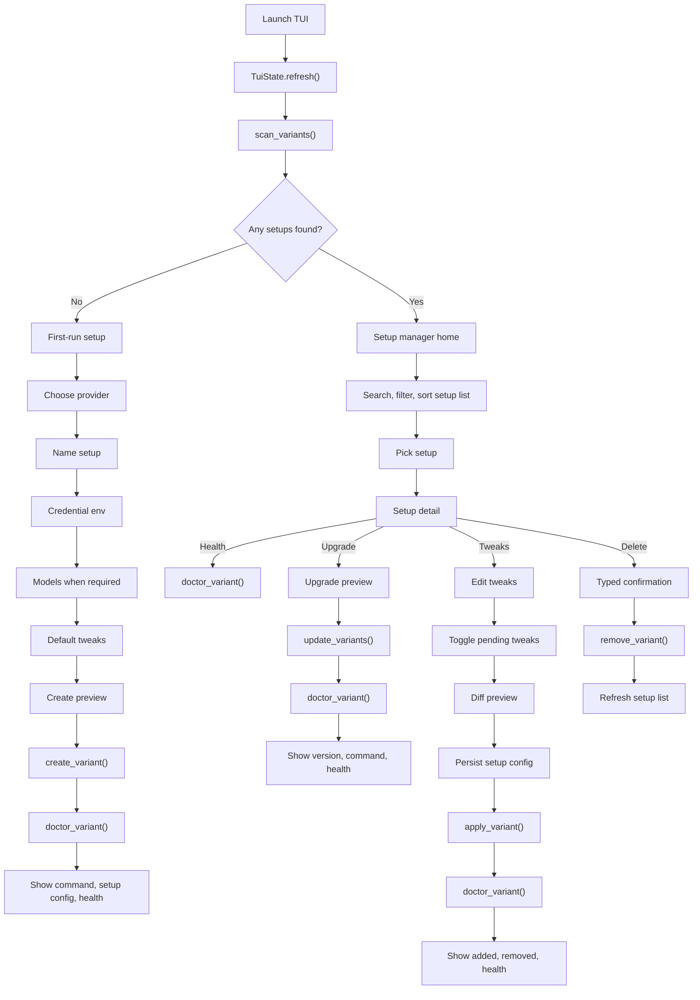

# TUI Flow Reference

This document is the working reference for the TUI user workflow as implemented in the current codebase.

Main design rule: the TUI is a setup lifecycle manager, not a set of backend feature tabs. The user-facing workflow is:

```text
Find setups -> pick setup -> choose action -> preview -> apply -> verify -> show next command
```

Terminology matters:

| Internal term | User-facing term |
| --- | --- |
| variant | setup |
| provider profile | provider |
| patch package | patch bundle |
| manifest | setup config |
| wrapper | command or launcher |

`variant` remains the internal storage model under `.cc-extractor/variants`. Patch packages remain advanced build inputs and are intentionally separate from setup tweaks.

## Implemented Flow

Launch now routes by setup discovery:



## Current Code Map

- `cc_extractor/tui/state.py`: lifecycle state, refresh, setup health cache, search/filter/sort fields.
- `cc_extractor/tui/options.py`: `MenuOption` rows for setup manager, setup detail, first-run setup, dashboard patch bundles, and tweak editor.
- `cc_extractor/tui/rendering.py`: text fallback, current labels, footer/key hints, breadcrumbs, ratatui frame rendering.
- `cc_extractor/tui/nav.py`: mode transitions, back behavior, tweak editor entry, tweak toggles, rebuild apply helper.
- `cc_extractor/tui/keys.py`: text input helpers for setup creation and dashboard profile names.
- `cc_extractor/tui/__init__.py`: action layer, startup routing, backend calls through `run_quiet()`, setup health/upgrade/delete/create handlers.

The TUI action layer imports and exposes:

- `create_variant()` for first-run and new setup creation.
- `update_variants()` for selected setup upgrade.
- `apply_variant()` for setup tweak rebuild.
- `remove_variant()` for typed delete confirmation.
- `doctor_variant()` for manual and post-action health checks.
- `scan_variants()` as the setup detection source of truth.

## Setup Manager

Home shows setup rows first:

```text
Name                 Provider     Claude Code  Health   Command
deepseek-main        deepseek     2.1.123      healthy  deepseek-main
openrouter-dev       openrouter   2.1.122      never    openrouter-dev
```

Implemented setup list controls:

- `/`: enter setup search. Text matches setup id/name, provider, Claude Code version, command path, and command basename.
- `P`: cycle provider filter through `all` and detected provider keys.
- `S`: cycle sort by `name`, `provider`, `health`, `updated`, and `version`.
- `R`: refresh workspace state from `scan_variants()`.

The `Create new setup` row stays pinned first. If search/filter hides all setup rows, the screen shows `No setups match current search/filter.` while keeping creation available.

Lifecycle keys:

```text
Enter  Manage selected setup
N      Create new setup
U      Upgrade selected setup
T      Edit tweaks
H      Run health check
D      Delete setup
R      Refresh
Q      Quit
```

Setup detail keeps the selected setup in context and exposes the same lifecycle actions plus copy/log helpers.

## First-Run Setup

With zero variants, startup routes to first-run setup and says no Claude Code setups were found.

The wizard reuses provider registry defaults:

- Provider defaults from `list_variant_providers()`.
- Setup name defaults from provider metadata.
- Credential env defaults from provider metadata.
- Model mapping is shown only when the provider requires it.
- Default tweaks come from `DEFAULT_TWEAK_IDS`: `themes`, `prompt-overlays`, `patches-applied-indication`.
- Create goes through a preview, then calls `create_variant()`.
- Successful create refreshes state, runs `doctor_variant()`, and shows command, setup config, and health.

Credential env validation checks whether required env vars are present before create. Raw API keys are not accepted in the TUI text input path.

## Upgrade

Upgrade is reachable from setup manager and setup detail.

The implemented flow is:

```text
Selected setup -> Upgrade preview -> y -> update_variants() -> refresh -> doctor_variant() -> result
```

The preview shows:

- Setup id.
- Current Claude Code version.
- Target version, currently `latest`.
- Tweak count.
- Command path.
- Rebuild yes/no.

On success, the result reports old version to new version, tweaks reapplied, command rebuilt path, and health.

On failure, the result reports only verified state:

- Base download status: `already cached`, `verified`, `not found`, or `unknown`.
- Whether the command path changed.
- Whether the previous setup still appears active, based on loadable setup config plus command/binary presence.
- Failed stage text from the backend exception.

The TUI does not claim rollback unless a future backend result explicitly verifies rollback.

## Delete

Delete is reachable from setup manager and setup detail.

The implemented flow is:

```text
Selected setup -> Type exact setup id -> remove_variant(..., yes=True) -> refresh
```

The confirmation screen shows:

- Setup directory.
- Command path.
- A statement that shared downloads and caches are not removed.

On success or failure, the result summary verifies:

- Setup directory removed: yes/no.
- Command removed: yes/no.
- Shared downloads untouched: yes.
- Safest next action.

Delete does not run health for the deleted setup.

## Tweaks

Tweaks are a setup action, not a top-level backend tab.

Implemented model:

| Internal concept | User-facing label | Where it belongs |
| --- | --- | --- |
| `patch_packages` | Patch bundles | Advanced Dashboard build flow |
| `selected_variant_tweaks` | Default tweaks | First-run setup wizard |
| `tweaks_pending` | Pending tweak changes | Selected setup -> Edit tweaks |
| `manifest["tweaks"]` | Enabled tweaks | Setup config |
| `PATCH_REGISTRY` patches | Available tweaks | Tweak editor registry |

The tweak editor keeps:

- Grouped `[x]` and `[ ]` rows.
- Right-side detail pane.
- Compatibility status: ready, advanced, env-backed, unsupported, blocked.
- Baseline vs pending state.
- Add/remove diff before rebuild.

Apply flow:

```text
Toggle tweaks -> A -> diff preview -> y -> write setup config -> apply_variant() -> doctor_variant()
```

Unsupported or blacklisted tweaks are blocked unless a future explicit force path is added.

## Advanced Dashboard

Dashboard remains advanced/build tooling. It is still accessible as a tab, but it is not the first screen.

Dashboard patch bundles are separate from setup tweaks:

- Patch bundles are build inputs for downloaded/native binaries.
- Setup tweaks are curated patch ids saved in a setup config and reapplied on rebuild/upgrade.

Do not merge these flows unless the product model changes.

## Implemented Acceptance Checks

- Launch with zero variants opens first-run setup.
- Launch with one or more variants opens setup manager.
- Home uses setup/provider/command/health language.
- `scan_variants()` remains setup detection source of truth.
- `create_variant()` is reachable from first-run and new setup.
- `update_variants()` is reachable from selected setup upgrade.
- `remove_variant()` is reachable only after typed delete confirmation.
- `apply_variant()` is used for tweak rebuild.
- `doctor_variant()` is reachable from home and setup detail.
- Manual health always calls `doctor_variant()`.
- Create, upgrade, and tweak rebuild run post-action health.
- Delete refreshes setup list and does not run health for deleted setup.
- Delete does not remove shared downloads or caches.
- Upgrade shows preview before applying.
- Tweak editor shows added/removed diff before rebuild.
- Setup list search/filter/sort are implemented.
- Failure summaries avoid unverified rollback claims.
- Existing theme system still controls all colors.
- Existing text fallback works for tests.

## Remaining P2 Follow-Up

The main lifecycle layer is implemented. Remaining work is narrower:

- Add `?` shortcut/help panel.
- Add richer backend-provided stage telemetry for create/upgrade/rebuild beyond the TUI's current filesystem verification.
- Add optional copy actions for setup config paths and logs, beyond the current command copy and logs view.
- Consider persisted setup list search/filter/sort preferences only if users need them.
- Tweak list search remains out of scope for setup list search/filter/sort.
- High contrast mode can be added as a theme later.

## Refresh Rules

Refresh workspace state:

- On launch.
- After `create_variant()`.
- After `update_variants()`.
- After `apply_variant()`.
- After `remove_variant()`.
- When the user presses `R`.

Health summaries are cached for the setup list. Manual health checks always call `doctor_variant()`.

Post-action health:

- After create, run `doctor_variant()` for the new setup.
- After upgrade, run `doctor_variant()` for the upgraded setup.
- After tweak rebuild, run `doctor_variant()` for the rebuilt setup.
- After delete, refresh setup list and do not run health for the deleted setup.

## Verification

Focused TUI verification:

```bash
rtk .venv/bin/python -m pytest -q tests/test_tui.py
```

Flow doc marker verification:

```bash
rtk rg -n "Implemented Flow|Remaining P2|update_variants|remove_variant|search|sort" docs/TUI_FLOW.md
```
