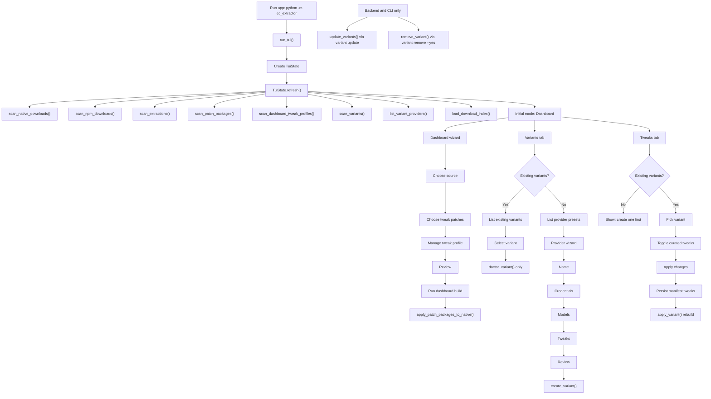
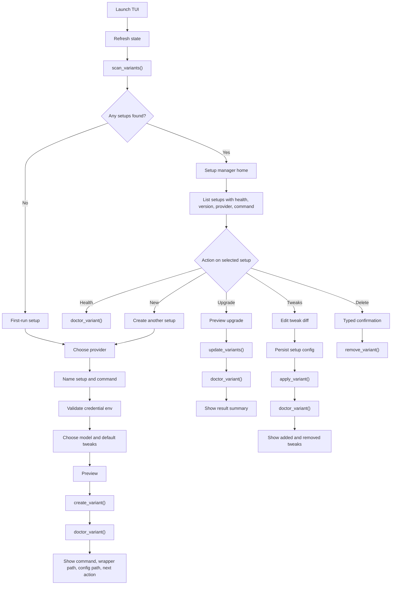

# TUI Flow Reference

This document is the working reference for the TUI user workflow. It separates the flow that exists today from the target setup lifecycle manager we want next.

Main design rule: the TUI should be a setup lifecycle manager, not a set of backend feature tabs. The user-facing workflow should be:

```text
Find setups -> pick setup -> choose action -> preview -> apply -> verify -> show next command
```

Terminology matters here: an existing named isolated Claude Code setup is a `variant` under `.cc-extractor/variants`. Patch packages are build inputs, not existing setups.

## Current Flow

Today the TUI starts on Dashboard, refreshes workspace state, and exposes variant lifecycle pieces across separate tabs. Existing variants can be checked from the Variants tab and tweaked from the Tweaks tab. Upgrade and uninstall exist in the backend and CLI, but are not wired into the TUI.



## Target Flow

The target TUI should detect whether any setups already exist and route the user into one of two visible modes:

- First-run setup: no variants found, say that clearly, then guide the user through provider setup.
- Setup manager: variants found, show existing setups first and offer upgrade, tweak, delete, health, and new setup actions.



## User-Facing Model

Use intent-based language in the UI. Keep backend terms available only in advanced or debug views.

| Internal term | User-facing term |
| --- | --- |
| variant | setup |
| provider profile | provider |
| patch package | tweak package or patch bundle |
| manifest | setup config |
| wrapper | command or launcher |

Suggested top-level destinations:

```text
Home
Create Setup
Manage Setup
Logs
Settings
Help
```

Home should replace the current Dashboard as the first screen. It should show detected setups and direct lifecycle actions without requiring users to know whether Variants or Tweaks owns an operation.

```text
Claude Code Setup Manager

Detected setups:
  deepseek-main     healthy      Claude Code 1.2.3     command: cc-deepseek
  openrouter-dev    warning      Claude Code 1.2.1     command: cc-openrouter

Actions:
  Enter  Manage selected setup
  N      Create new setup
  U      Upgrade selected setup
  T      Edit tweaks
  H      Run health check
  D      Delete setup
  R      Refresh
  Q      Quit
```

## First-Run Setup

First-run setup should be basic by default and advanced only when needed. The required path:

```text
No Claude Code setups found.

Create your first setup:
  Provider: DeepSeek
  Setup name: deepseek-main
  Command: cc-deepseek
  API key env: DEEPSEEK_API_KEY
  Credential status: found
  Model: deepseek-chat
  Tweaks: themes, prompt overlays, patch indicator

Create setup
```

Requirements:

- Show "no setups found" before starting the wizard.
- Prefer provider defaults from the registry.
- Hide full model mapping unless the provider requires it or the user opens Advanced.
- Validate credential env presence before create. Endpoint reachability can be a follow-up check if the backend adds it.
- End every successful create with the run command, wrapper path, setup config path, and next actions.
- Run `doctor_variant()` after `create_variant()` and show the health result.

Creation result should look like:

```text
Setup created.

Run it with:
  cc-deepseek

Command:
  ~/.local/bin/cc-deepseek

Config:
  .cc-extractor/variants/deepseek-main/variant.json

Actions:
  Enter  Test launch
  C      Copy command
  H      Run health check
```

## Setup Management

The setup manager home should make health visible before the user chooses an action.

```text
Name            Provider     Claude Code   Health      Last checked
deepseek-main   deepseek     1.2.3         healthy     2m ago
openrouter-dev  openrouter   1.2.1         warning     1d ago
ollama-local    ollama       1.2.3         broken      never
```

Warnings should be actionable:

```text
openrouter-dev warning:
  API key env OPENROUTER_API_KEY is not set
  Command exists
  Config exists
  Claude Code binary found
```

The selected setup detail view should group lifecycle actions around the setup:

```text
deepseek-main

Status: Healthy
Provider: DeepSeek
Claude Code: 1.2.3
Command: ~/.local/bin/cc-deepseek
Tweaks: 3 enabled

Actions:
  Run health check
  Upgrade Claude Code
  Change model mapping
  Edit credential env vars
  Edit tweaks
  Rebuild command
  Show files
  Delete setup
```

### Upgrade

Upgrade must preview changes before calling `update_variants()`.

```text
Upgrade preview:
  Setup: deepseek-main
  Current Claude Code: 1.2.1
  Target Claude Code: 1.2.3
  Tweaks to reapply: 3
  Command will be rebuilt: yes

Proceed? y/N
```

After upgrade, run `doctor_variant()` and summarize:

```text
Upgrade complete:
  Claude Code: 1.2.1 -> 1.2.3
  Tweaks reapplied: 3/3
  Command rebuilt: ~/.local/bin/cc-deepseek
  Health: healthy
```

Failure states must say whether the previous setup remains active:

```text
Upgrade failed during tweak application.

Base download succeeded.
Command was not replaced.
Previous setup is still active.
Failed tweak: prompt-overlays
```

### Tweaks

Tweaks are an action on the selected setup, not a top-level destination.

```text
Tweaks:
  [x] themes
  [x] prompt-overlays
  [x] patches-applied-indication
  [ ] compact-toolbar
  [ ] custom-statusline

Pending changes:
  Add: compact-toolbar
  Remove: none

Apply and rebuild? y/N
```

After rebuild, run `doctor_variant()` and show diff-style feedback:

```text
Tweaks updated:
  Added: compact-toolbar
  Removed: none
  Rebuild: successful
  Health: healthy
```

### Delete

Delete must use typed confirmation, not a single `y`.

```text
Delete setup: deepseek-main

This will remove:
  .cc-extractor/variants/deepseek-main
  ~/.local/bin/cc-deepseek

Type deepseek-main to confirm:
```

Default delete behavior should remove only the setup directory and command. It should not delete shared downloads or caches. Optional keep/delete choices for logs or other generated records can be added after the basic delete flow is wired.

## Navigation

Use consistent keys everywhere:

```text
Up/Down  Move
Enter    Select
Esc      Back
R        Refresh
?        Shortcuts
Q        Quit
```

Contextual actions:

```text
N        New setup
U        Upgrade
T        Tweaks
D        Delete
H        Health
L        Logs
C        Copy command or path
```

Add breadcrumbs or a persistent mode header so users do not lose context:

```text
Home > deepseek-main > Edit tweaks
```

If many setups exist, add:

```text
/        Search setups
P        Filter by provider
S        Sort
```

Sort options should include name, provider, health, last modified, and Claude Code version.

## Provider Profiles

The provider registry already includes presets such as `zai`, `deepseek`, `minimax`, `ollama`, `ccrouter`, `openrouter`, `vercel`, `kimi`, `nanogpt`, `poe`, `alibaba`, `cerebras`, `gatewayz`, `mirror`, and `custom`.

Current defaults are provider registry values plus `DEFAULT_TWEAK_IDS`:

- `themes`
- `prompt-overlays`
- `patches-applied-indication`

These are not saved workspace profiles today. Future default profiles should be a UX layer over provider presets unless we intentionally add seeded profile files and migration rules.

## State Model

Use an explicit setup-lifecycle state model. Do not let implementation drift back into tab ownership as the primary navigation model.

```text
TuiMode:
  Loading
  FirstRunSetup
  SetupManager
  SetupDetail
  UpgradePreview
  TweakEditor
  DeleteConfirm
  HealthResult
  Logs
  Error
```

State ownership:

- `Loading` refreshes workspace state and routes to `FirstRunSetup` or `SetupManager`.
- `FirstRunSetup` owns provider selection, setup name, command name, credential env, model choices, default tweaks, preview, create, and post-create health.
- `SetupManager` owns the setup list, search, filters, sort, refresh, and selected setup pointer.
- `SetupDetail` owns setup-level actions and advanced metadata display.
- `UpgradePreview`, `TweakEditor`, and `DeleteConfirm` own their own preview or confirmation state.
- `HealthResult` displays the latest doctor result for the selected setup.
- `Logs` is read-only in v1.
- `Error` shows plain text failure details and a recovery action.

## Refresh Rules

Refresh workspace state:

- On launch.
- After `create_variant()`.
- After `update_variants()`.
- After `apply_variant()`.
- After `remove_variant()`.
- When the user presses `R`.

`scan_variants()` remains the setup detection source of truth. Health summaries may be cached for the setup list, but manual health check must always call `doctor_variant()`.

Post-action health:

- After create, run `doctor_variant()` for the new setup.
- After upgrade, run `doctor_variant()` for the upgraded setup.
- After tweak rebuild, run `doctor_variant()` for the rebuilt setup.
- After delete, refresh the setup list and do not run health for the deleted setup.

## Failure States

Upgrade failure handling must say whether the previous setup remains active. Create and delete need the same level of clarity.

Create failure:

```text
Create failed.

Setup directory created: yes/no
Command created: yes/no
Previous state changed: yes/no
Cleanup needed: yes/no
```

Delete failure:

```text
Delete failed.

Setup directory removed: yes/no
Command removed: yes/no
Shared downloads untouched: yes
```

Failure display rules:

- Never imply rollback happened unless the code verified it.
- Show the operation that failed, the setup affected, and the next safest action.
- Preserve shared downloads and caches unless the user explicitly chooses a future cleanup action.
- If only part of a setup was changed, show which paths changed.

## Acceptance Checks

Implementation should be considered incomplete until these pass:

- Launch with zero variants opens `FirstRunSetup`.
- Launch with one or more variants opens `SetupManager`.
- Home shows setup rows using setup/provider/command language, not variant/manifest/wrapper language.
- Upgrade action is visible only when a setup is selected.
- Upgrade shows a preview before `update_variants()`.
- Delete requires typing the selected setup name before `remove_variant()`.
- Delete does not remove shared downloads or caches by default.
- Tweak changes show added and removed diff before `apply_variant()`.
- Manual health check always calls `doctor_variant()`.
- Create, upgrade, and tweak rebuild run a post-action health check.
- `create_variant()`, `update_variants()`, `apply_variant()`, `remove_variant()`, and `doctor_variant()` are reachable from the TUI.
- Pressing `R` refreshes setup state from `scan_variants()`.

## Global Context

Future global mode should not be blocked by the v1 design:

- The setup manager should not assume a single workspace forever.
- Each setup row should be able to include project or workspace ownership later.
- Avoid hard-coding one `.cc-extractor` root into UI state where possible.
- Keep workspace root display available in advanced details.
- Treat setup identity as workspace plus setup id when future global listings are added.

## Implementation Priorities

- Use `scan_variants()` as the setup detection source of truth.
- Treat `.cc-extractor/variants/<variant-id>/variant.json` as the existing setup record.
- Keep Dashboard patch-package flows separate from named variants.
- Reuse existing backend operations before adding new lifecycle code:
  - `create_variant()` for new setup.
  - `update_variants()` for upgrade.
  - `apply_variant()` for rebuild after tweak changes.
  - `remove_variant()` for uninstall.
  - `doctor_variant()` for health.
- The current TUI already has create, doctor/status, and tweak rebuild pieces. Missing TUI wiring is upgrade/update and uninstall.

P0:

- Wire `update_variants()` to an Upgrade action.
- Wire `remove_variant()` to a Delete setup action with typed confirmation.
- Make `doctor_variant()` available from Home and selected setup detail.
- Keep `apply_variant()` as the rebuild operation after tweak changes.
- Keep `create_variant()` as the operation for first-run and new setup.

P1:

- Replace tab-first startup with setup-first routing:
  - No setups found -> First-run setup.
  - Setups found -> Setup manager home.
- Rename user-facing concepts to setup, provider, tweaks, command, health check, delete, and upgrade.
- Add health summaries after create, upgrade, tweak rebuild, manual health check, and refresh.

P2:

- Add previews before upgrade, tweak rebuild, delete, and provider/model changes.
- Add copy actions for run command, command path, setup config path, and logs path.
- Add accessibility polish: no color-only status indicators, high contrast mode, stable focus order, selected row marker, shortcut panel, plain text errors, resizable layouts, and wrapped log views.

## Verification

This file is docs-only. No pytest is required for this step.

Verify the reference exists and contains both Mermaid flows plus the backend lifecycle markers:

```bash
rg -n "flowchart|Current Flow|Target Flow|scan_variants|update_variants|remove_variant" docs/TUI_FLOW.md
```
