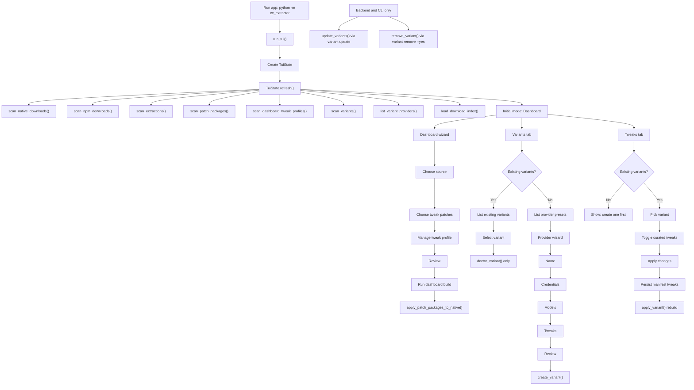
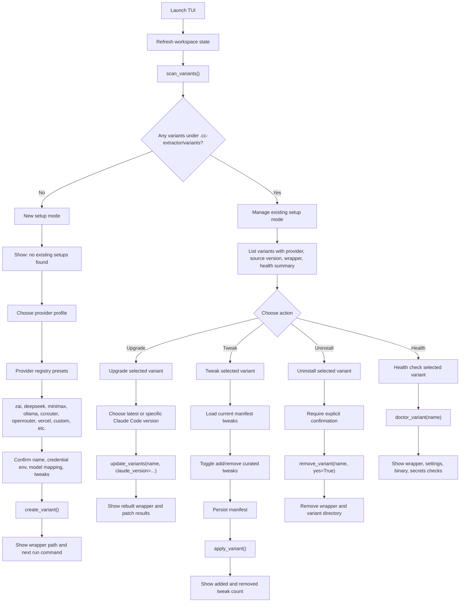

# TUI Flow Reference

This document is the working reference for the TUI user workflow. It separates the flow that exists today from the proposed two-mode flow we want next.

Terminology matters here: an existing named isolated Claude Code setup is a `variant` under `.cc-extractor/variants`. Patch packages are build inputs, not existing setups.

## Current Flow

Today the TUI starts on Dashboard, refreshes workspace state, and exposes variant lifecycle pieces across separate tabs. Existing variants can be checked from the Variants tab and tweaked from the Tweaks tab. Upgrade and uninstall exist in the backend and CLI, but are not wired into the TUI.



## Proposed Flow

The proposed TUI should detect whether any variants already exist and route the user into one of two modes:

- New setup mode: no variants found, say that clearly, then guide the user through provider setup.
- Manage existing setup mode: variants found, show existing setups first and offer upgrade, tweak, uninstall, and health actions.



## Provider Profiles

The provider registry already includes presets such as `zai`, `deepseek`, `minimax`, `ollama`, `ccrouter`, `openrouter`, `vercel`, `kimi`, `nanogpt`, `poe`, `alibaba`, `cerebras`, `gatewayz`, `mirror`, and `custom`.

Current defaults are provider registry values plus `DEFAULT_TWEAK_IDS`:

- `themes`
- `prompt-overlays`
- `patches-applied-indication`

These are not saved workspace profiles today. Future default profiles should be a UX layer over provider presets unless we intentionally add seeded profile files and migration rules.

## Implementation Notes

- Use `scan_variants()` as the setup detection source of truth.
- Treat `.cc-extractor/variants/<variant-id>/variant.json` as the existing setup record.
- Keep Dashboard patch-package flows separate from named variants.
- Reuse existing backend operations before adding new lifecycle code:
  - `create_variant()` for new setup.
  - `update_variants()` for upgrade.
  - `apply_variant()` for rebuild after tweak changes.
  - `remove_variant()` for uninstall.
  - `doctor_variant()` for health.
- The current TUI already has create, doctor/status, and tweak rebuild pieces. Missing TUI wiring is upgrade/update and uninstall.

## Verification

This file is docs-only. No pytest is required for this step.

Verify the reference exists and contains both Mermaid flows plus the backend lifecycle markers:

```bash
rg -n "flowchart|Current Flow|Proposed Flow|scan_variants|update_variants|remove_variant" docs/TUI_FLOW.md
```
